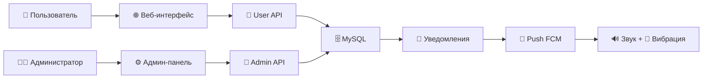

# 🏆 Система учёта очков ОПГ


> Полнофункциональная система мотивации и контроля для организованных групп с веб-интерфейсом и мобильными уведомлениями
## 🎯 Описание проекта

Комплексная система управления очками для членов организованной группы, включающая:
- **Административная панель** для управления участниками и начисления очков
- **Пользовательский интерфейс** для отслеживания прогресса и истории
- **Система достижений** с прогрессивной разблокировкой
- **Умные уведомления** с аудио-сопровождением и вибрацией
- **Аналитика активности** с интерактивными графиками

## ✨ Ключевые возможности

### 👨‍💼 Для администраторов
- ➕ **Начисление очков** с указанием причины
- ➖ **Списание очков** за нарушения
- 👥 **Управление пользователями** (добавление/удаление)
- 🏅 **Создание достижений** с условиями получения
- 📊 **Калькулятор эффективности** для расчёта премий
- 📈 **Мониторинг активности** всех участников

### 👤 Для пользователей
- 💰 **Личный баланс очков** в реальном времени
- 📋 **История операций** с детальными причинами
- 🏆 **Система достижений** с прогресс-барами
- 📊 **График недельной активности** (SVG)
- 🔔 **Уведомления** о изменениях баланса
- 🖼️ **Персонализация** через загрузку аватаров

### 🔊 Аудио-система
- 🎵 **Тематическая музыка** при начислении/списании очков
- 📱 **Push-уведомления** с автоматическим увеличением громкости
- 📳 **Вибрация** при получении уведомлений

## 🏗️ Архитектура

```
📁 opg-658-system/
├── 🌐 opg-658.ru/          # Пользовательский интерфейс
│   ├── 📄 user.html         # Главная страница
│   ├── 🎨 user-styles.css   # Стили
│   ├── ⚡ user.js           # Логика
│   ├── 🔌 api.php           # REST API (пользователь)
│   ├── 📁 config/           # Конфигурация
│   │   ├── database.php     # Подключение к БД
│   │   └── fcm.php          # Отправка FCM (по желанию)
│   ├── 🎵 *.mp3             # Аудиофайлы
│   └── 📁 uploads/          # Аватары пользователей
│
├── ⚙️ opg-658.online/       # Административная панель
│   ├── 📄 admin.html        # Админ-интерфейс
│   ├── 🎨 admin-styles.css  # Админ-стили
│   ├── ⚡ admin.js          # Админ-логика
│   ├── 🔌 api.php           # Админ API
│   └── 📁 config/           # Конфигурация
│       └── database.php     # Подключение к БД
│
├── 🗄️ points_operations.sql # Структура БД
├── opg658.apk               # APK Android‑приложения
└── 🖼️ opg.png               # Обложка/иконка проекта
```

### 🔄 Поток данных



## 🚀 Быстрый старт

### Требования
- **PHP** 7.4+ (с PDO, MySQL)
- **MySQL** 8.0+
- **Apache/Nginx** с mod_rewrite
- **Современный браузер** с поддержкой ES6+

### Установка

1. **Клонируйте репозиторий**
   ```bash
   git clone https://github.com/yourusername/opg-658-system.git
   cd opg-658-system
   ```

2. **Настройте базу данных**
   ```sql
   CREATE DATABASE opg_system CHARACTER SET utf8mb4 COLLATE utf8mb4_unicode_ci;
   SOURCE points_operations.sql;
   ```

3. **Конфигурация подключения**
   ```php
   // opg-658.ru/config/database.php
   define('DB_HOST', 'localhost');
   define('DB_NAME', 'opg_system');
   define('DB_USER', 'your_user');
   define('DB_PASS', 'your_password');
   ```

4. **Права доступа**
   ```bash
   chmod 755 opg-658.ru/uploads/
   chmod 644 opg-658.ru/uploads/.htaccess
   ```

5. **Настройка доменов**
   - `opg-658.ru` → пользовательский интерфейс
   - `opg-658.online` → административная панель

### 🎬 Демо

**Пользовательская панель**: [https://opg-658.ru](https://opg-658.ru)  
**Административная панель**: [https://opg-658.online](https://opg-658.online)

## 📱 Android-приложение

> Примечание: исходники Android-приложения в этом архиве удалены для облегчения загрузки. Клиентская логика рассчитана на работу с теми же API и может быть собрана отдельно (WebView + уведомления). Ниже остаются справочные фрагменты.

### Архитектура мобильного приложения (справочно)

```kotlin
// MainActivity.kt - WebView с FCM поддержкой
class MainActivity : AppCompatActivity() {
    private lateinit var webView: WebView
    private lateinit var audioManager: AudioManager
    
    override fun onCreate(savedInstanceState: Bundle?) {
        setupWebView()
        initializeFCM()
        setupAudioControls()
    }
}
```

### Push-уведомления с автоматической громкостью

```kotlin
// FCMService.kt - Обработка уведомлений
class FCMService : FirebaseMessagingService() {
    override fun onMessageReceived(message: RemoteMessage) {
        increaseVolume()        // 🔊 Увеличиваем громкость
        playNotificationSound() // 🎵 Проигрываем звук
        triggerVibration()      // 📳 Вибрация
        showNotification(message)
    }
    
    private fun increaseVolume() {
        val audioManager = getSystemService(Context.AUDIO_SERVICE) as AudioManager
        val maxVolume = audioManager.getStreamMaxVolume(AudioManager.STREAM_MUSIC)
        audioManager.setStreamVolume(AudioManager.STREAM_MUSIC, maxVolume, 0)
    }
}
```

### Особенности мобильной версии
- 📱 **WebView-интерфейс** с нативными функциями
- 🔊 **Автоматическое управление громкостью** при уведомлениях
- 📳 **Вибрация** при получении очков/штрафов
- 🎵 **Кастомные звуки** для разных типов операций
- 🔋 **Работа в фоне** для получения уведомлений

## 📊 API Endpoints

### 👤 Пользовательский API (`/opg-658.ru/api.php`)

| Метод | Endpoint | Описание |
|-------|----------|----------|
| `GET` | `?action=getUserData&user_id=1` | Данные пользователя |
| `GET` | `?action=getUserHistory&user_id=1` | История операций |
| `GET` | `?action=getWeeklyActivity&user_id=1` | Недельная активность |
| `GET` | `?action=getUserAchievements&user_id=1` | Достижения |
| `GET` | `?action=getUserNotifications&user_id=1` | Уведомления |
| `POST` | `?action=uploadAvatar` | Загрузка аватара |
| `POST` | `?action=markAllNotificationsRead` | Отметить все как прочитанные |

### ⚙️ Административный API (`/opg-658.online/api.php`)

| Метод | Endpoint | Описание |
|-------|----------|----------|
| `GET` | `?action=getUsers` | Список всех пользователей |
| `GET` | `?action=getAchievements` | Список достижений |
| `POST` | `?action=addPoints` | Начисление очков |
| `POST` | `?action=removePoints` | Списание очков |
| `POST` | `?action=addUser` | Добавление пользователя |
| `DELETE` | `?action=deleteUser` | Удаление пользователя |
| `POST` | `?action=addAchievement` | Создание достижения |

## 🎨 Технические особенности

### Frontend
- **🔄 Автообновление** каждые 30 секунд
- **📱 Адаптивный дизайн** для всех устройств
- **🖼️ SVG-графики** для интерактивной аналитики
- **🎭 Анимации** и плавные переходы
- **⚡ Vanilla JavaScript** без зависимостей

### Backend
- **🛡️ PDO Prepared Statements** против SQL-инъекций
- **🔐 Разделение доступов** пользователи/админы
- **📁 Безопасная загрузка файлов** с валидацией
- **⚡ Оптимизированные запросы** к БД

### Безопасность
- **🚫 .htaccess защита** папки uploads
- **✅ Валидация данных** на сервере и клиенте  
- **🔒 Разделение доменов** для разных ролей
- **🛡️ Escape HTML** в выводе данных

## 🎵 Аудио-система

### Файлы
- **`tiomnaia-noch.mp3`** - при начислении очков ✅
- **`crying-goblin.mp3`** - при списании очков ❌

### Логика воспроизведения
```javascript
// Автоматическое воспроизведение при изменении баланса
function playPointsMusic(type) {
    const audio = new Audio(type === 'add' ? 'tiomnaia-noch.mp3' : 'crying-goblin.mp3');
    audio.volume = 0.7;
    audio.play().catch(console.error);
}
```

## 🏅 Система достижений

### Типы достижений
- **💰 По балансу очков** - "Первая сотня", "Миллионер"
- **📈 По активности** - "Активист недели", "Марафонец"
- **⏰ По времени** - "Ветеран", "Новичок года"
- **🎯 Специальные** - кастомные условия

### Пример конфигурации
```javascript
const achievements = [
    {
        id: 1,
        name: "Первые очки",
        description: "Получите первые 10 очков",
        icon: "🎯",
        requirement: "points >= 10",
        progress: true
    }
];
```

## 📱 Развертывание Android-приложения

### 1. Создание проекта в Android Studio

```kotlin
// build.gradle (Module: app)
dependencies {
    implementation 'com.google.firebase:firebase-messaging:23.0.0'
    implementation 'androidx.webkit:webkit:1.4.0'
}
```

### 2. Настройка Firebase Cloud Messaging

```kotlin
// FCMService.kt
class FCMService : FirebaseMessagingService() {
    override fun onMessageReceived(remoteMessage: RemoteMessage) {
        // Увеличиваем громкость
        val audioManager = getSystemService(Context.AUDIO_SERVICE) as AudioManager
        val currentVolume = audioManager.getStreamVolume(AudioManager.STREAM_MUSIC)
        val maxVolume = audioManager.getStreamMaxVolume(AudioManager.STREAM_MUSIC)
        
        // Сохраняем текущую громкость
        val originalVolume = currentVolume
        
        // Устанавливаем максимальную громкость
        audioManager.setStreamVolume(AudioManager.STREAM_MUSIC, maxVolume, 0)
        
        // Проигрываем звук
        playCustomSound(remoteMessage.data["type"])
        
        // Вибрация
        triggerVibration()
        
        // Показываем уведомление
        showNotification(remoteMessage)
        
        // Возвращаем оригинальную громкость через 3 секунды
        Handler(Looper.getMainLooper()).postDelayed({
            audioManager.setStreamVolume(AudioManager.STREAM_MUSIC, originalVolume, 0)
        }, 3000)
    }
    
    private fun playCustomSound(type: String?) {
        val soundResource = when(type) {
            "points_added" -> R.raw.tiomnaia_noch
            "points_removed" -> R.raw.crying_goblin
            else -> R.raw.default_notification
        }
        
        val mediaPlayer = MediaPlayer.create(this, soundResource)
        mediaPlayer.setOnCompletionListener { it.release() }
        mediaPlayer.start()
    }
    
    private fun triggerVibration() {
        val vibrator = getSystemService(Context.VIBRATOR_SERVICE) as Vibrator
        if (Build.VERSION.SDK_INT >= Build.VERSION_CODES.O) {
            vibrator.vibrate(VibrationEffect.createOneShot(500, VibrationEffect.DEFAULT_AMPLITUDE))
        } else {
            vibrator.vibrate(500)
        }
    }
}
```

### 3. Разрешения в AndroidManifest.xml

```xml
<uses-permission android:name="android.permission.INTERNET" />
<uses-permission android:name="android.permission.VIBRATE" />
<uses-permission android:name="android.permission.MODIFY_AUDIO_SETTINGS" />
<uses-permission android:name="android.permission.WAKE_LOCK" />

<service android:name=".FCMService"
    android:exported="false">
    <intent-filter>
        <action android:name="com.google.firebase.MESSAGING_EVENT" />
    </intent-filter>
</service>
```

## 🗄️ Структура базы данных

### Основные таблицы

```sql
-- Пользователи
CREATE TABLE users (
    id INT PRIMARY KEY AUTO_INCREMENT,
    name VARCHAR(100) NOT NULL,
    points INT DEFAULT 0,
    avatar VARCHAR(255),
    created_at TIMESTAMP DEFAULT CURRENT_TIMESTAMP
);

-- Операции с очками
CREATE TABLE points_operations (
    id INT PRIMARY KEY AUTO_INCREMENT,
    user_id INT NOT NULL,
    points_change INT NOT NULL,
    reason TEXT,
    admin_name VARCHAR(100),
    created_at TIMESTAMP DEFAULT CURRENT_TIMESTAMP,
    is_read BOOLEAN DEFAULT FALSE,
    FOREIGN KEY (user_id) REFERENCES users(id)
);

-- Достижения
CREATE TABLE achievements (
    id INT PRIMARY KEY AUTO_INCREMENT,
    name VARCHAR(100) NOT NULL,
    description TEXT,
    icon VARCHAR(10),
    requirement_type ENUM('points', 'operations', 'days', 'custom'),
    requirement_value INT,
    created_at TIMESTAMP DEFAULT CURRENT_TIMESTAMP
);

-- Полученные достижения
CREATE TABLE user_achievements (
    user_id INT,
    achievement_id INT,
    earned_at TIMESTAMP DEFAULT CURRENT_TIMESTAMP,
    PRIMARY KEY (user_id, achievement_id)
);
```

## ⚙️ Конфигурация

### Настройка базы данных

```php
// config/database.php
define('DB_HOST', 'localhost');
define('DB_NAME', 'opg_system');
define('DB_USER', 'your_username');
define('DB_PASS', 'your_password');
define('DB_CHARSET', 'utf8mb4');

function getDBConnection() {
    try {
        $pdo = new PDO(
            "mysql:host=" . DB_HOST . ";dbname=" . DB_NAME . ";charset=" . DB_CHARSET,
            DB_USER,
            DB_PASS,
            [
                PDO::ATTR_ERRMODE => PDO::ERRMODE_EXCEPTION,
                PDO::ATTR_DEFAULT_FETCH_MODE => PDO::FETCH_ASSOC,
                PDO::ATTR_EMULATE_PREPARES => false
            ]
        );
        return $pdo;
    } catch(PDOException $e) {
        error_log("Database connection failed: " . $e->getMessage());
        return null;
    }
}
```

### Настройка веб-сервера

```apache
# .htaccess для uploads/
Options -ExecCGI
AddHandler cgi-script .php .pl .py .jsp .asp .sh .cgi
Options -Indexes
<FilesMatch "\.(jpg|jpeg|png|gif|webp)$">
    Order allow,deny
    Allow from all
</FilesMatch>
<FilesMatch "\.(php|pl|py|jsp|asp|sh|cgi)$">
    Order deny,allow
    Deny from all
</FilesMatch>
```

## 🔧 Разработка

### Добавление новых достижений

```javascript
// В admin.js
function addCustomAchievement() {
    const achievement = {
        name: "Новое достижение",
        description: "Описание условий получения",
        icon: "🏆",
        requirement_type: "points",
        requirement_value: 100
    };
    
    fetch('api.php?action=addAchievement', {
        method: 'POST',
        headers: { 'Content-Type': 'application/json' },
        body: JSON.stringify(achievement)
    });
}
```

### Кастомизация аудио-уведомлений

```javascript
// В user.js
const audioSettings = {
    pointsAdded: {
        file: 'tiomnaia-noch.mp3',
        volume: 0.8,
        vibration: [100, 200, 100]
    },
    pointsRemoved: {
        file: 'crying-goblin.mp3', 
        volume: 0.9,
        vibration: [200, 100, 200, 100, 200]
    }
};
```

## 📈 Мониторинг и аналитика

### Автоматическое обновление данных
- **⏱️ Пользовательские данные**: обновление каждые 30 секунд
- **🔔 Проверка уведомлений**: каждые 5 секунд
- **📊 График активности**: при каждом обновлении
- **🏆 Прогресс достижений**: в реальном времени

### Метрики производительности
- **🚀 Время загрузки**: < 2 секунд
- **📡 Размер API-ответов**: < 50KB
- **💾 Использование памяти**: оптимизировано для мобильных устройств
- **🔄 Частота обновлений**: настраивается

## 🔒 Безопасность

### Меры защиты
- **🛡️ SQL-инъекции**: PDO Prepared Statements
- **🚫 XSS**: htmlspecialchars() для всех выводов
- **📁 Загрузка файлов**: валидация типов и размеров
- **🔐 Доступ к API**: проверка ролей
- **🚨 Логирование**: запись всех операций

### Рекомендации
- Используйте HTTPS для продакшена
- Настройте регулярные бэкапы БД
- Ограничьте размер загружаемых файлов
- Включите логирование ошибок PHP

## 🤝 Участие в разработке

### Структура коммитов
```
type(scope): description

feat(user): добавить систему рейтингов
fix(admin): исправить валидацию форм
docs(readme): обновить документацию API
style(css): улучшить мобильную версию
```

### Процесс разработки
1. Fork репозитория
2. Создайте feature-ветку
3. Внесите изменения с тестами
4. Создайте Pull Request

## 📋 TODO

### 🔥 Высокий приоритет
- [ ] Push-уведомления через FCM
- [ ] Улучшение мобильной версии
- [ ] Система бэкапов

### 📈 Средний приоритет  
- [ ] Экспорт данных в Excel/CSV
- [ ] Темная тема интерфейса
- [ ] Система ролей (модераторы)

### 💡 Низкий приоритет
- [ ] Интеграция с Telegram Bot
- [ ] Мультиязычность
- [ ] PWA-версия
