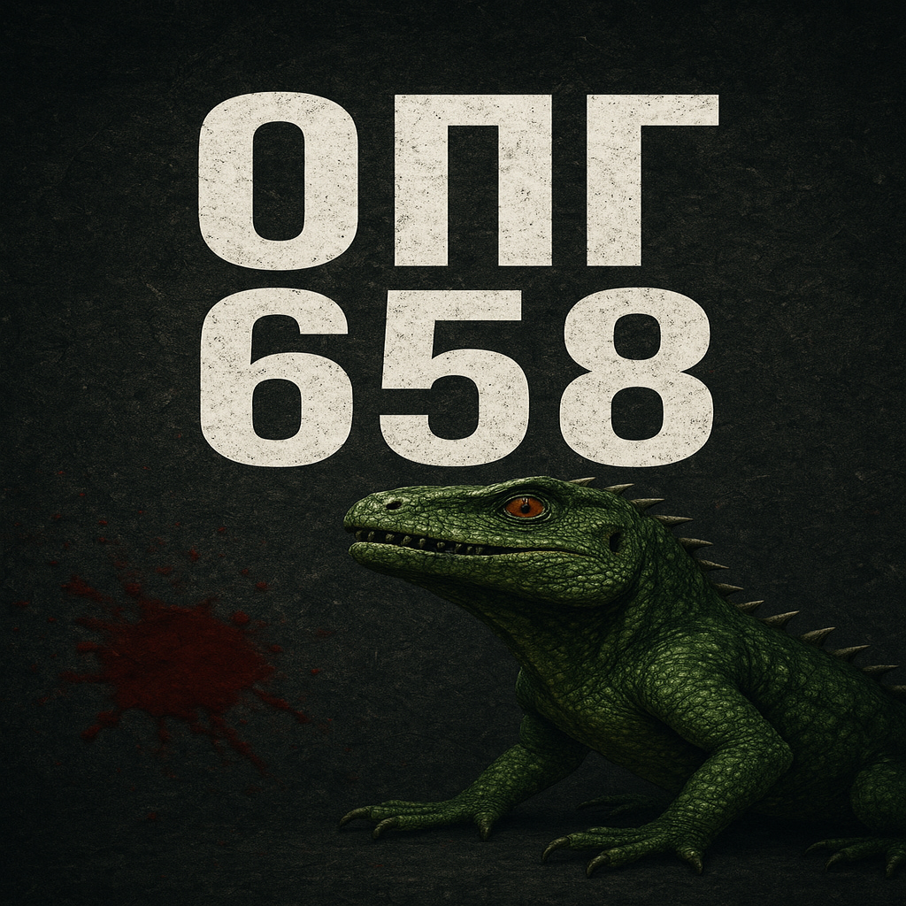

## OPG-658 — система учёта очков и Android‑приложение



Документация отражает текущее состояние проекта: два веб‑сайта (пользовательский и админский), серверные API на PHP/MySQL, SQL‑схема БД и Android‑приложение с WebView, локальными уведомлениями и фоновым сервисом.

---

### 1. Структура проекта

```text
c:\Users\Slava\Downloads\opg\
├─ 1.txt
├─ opg-658.online\
│  ├─ admin-styles.css
│  ├─ admin.html
│  ├─ admin.js
│  └─ api.php
├─ opg-658.ru\
│  ├─ api.php
│  ├─ config\
│  │  └─ database.php
│  ├─ crying-goblin.mp3
│  ├─ tiomnaia-noch.mp3
│  ├─ uploads\
│  │  └─ avatars\
│  ├─ user-styles.css
│  ├─ user.html
│  └─ user.js
├─ android-opg-webview\
│  ├─ settings.gradle
│  ├─ build.gradle
│  ├─ gradle.properties
│  └─ app\
│     ├─ build.gradle
│     ├─ proguard-rules.pro
│     └─ src\
│        └─ main\
│           ├─ AndroidManifest.xml
│           ├─ java\com\opg658\webview\
│           │  ├─ MyApp.kt
│           │  ├─ MainActivity.kt
│           │  ├─ Notifications.kt
│           │  ├─ background\PollingService.kt
│           │  └─ messaging\AppFirebaseMessagingService.kt
│           └─ res\
│              ├─ layout\activity_main.xml
│              ├─ raw\notification_sound.mp3
│              ├─ values\{strings.xml,themes.xml,colors.xml}
│              ├─ drawable-nodpi\opg_bitmap.xml
│              └─ mipmap-anydpi-v26\{ic_launcher.xml,ic_launcher_round.xml,ic_launcher_foreground.xml,app_icon.xml,opg.xml}
├─ points_operations.sql
└─ opg.png
```

Примечание: артефакты сборки/IDE удалены; Gradle создаст их при первой сборке Android‑модуля.

---

### 2. Описание файлов

#### Корень
- `opg.png`
  - Назначение: фирменное изображение; используется в документации и как источник для иконки Android.
- `points_operations.sql`
  - Назначение: DDL‑скрипт БД (пользователи, операции, достижения и пр.).

#### Пользовательский сайт `opg-658.ru`
- `user.html`, `user-styles.css`, `user.js`
  - Назначение: дашборд участника (баланс, история, достижения, графики, аватар).
  - Связи: запрашивает данные у `opg-658.ru/api.php`.
- `api.php`
  - Назначение: REST для пользовательского фронта (данные/история/достижения/уведомления/аватар и др.).
  - Связи: `config/database.php` (PDO), таблицы из `points_operations.sql`.
- `config/database.php`
  - Назначение: подключение к MySQL (PDO, UTF8MB4, строгая обработка ошибок).
- `crying-goblin.mp3`, `tiomnaia-noch.mp3` — звуки для UI‑событий.
- `uploads/avatars/` — хранилище аватаров.

#### Админ‑зона `opg-658.online`
- `admin.html`, `admin-styles.css`, `admin.js` — веб‑интерфейс для начислений/списаний, управления пользователями и достижениями.
- `api.php` — серверная логика админки; обновляет БД, при опции FCM отправляет пуши о начислениях/списаниях.

#### Android `android-opg-webview`
- Корневые Gradle‑файлы: `settings.gradle`, `build.gradle`, `gradle.properties`.
- `app/build.gradle` — конфигурация модуля (SDK 34, Kotlin 1.9; `androidx`, `material`, `webkit`, `okhttp`, опционально `firebase-messaging`).
- `src/main/AndroidManifest.xml` — разрешения (INTERNET, POST_NOTIFICATIONS, VIBRATE, MODIFY_AUDIO_SETTINGS, FOREGROUND_SERVICE / DATA_SYNC); активити/сервисы.
- `MainActivity.kt` — полноэкранный `WebView` на `https://opg-658.ru/user.html`, авто‑reload 30 сек, запуск фонового сервиса.
- `MyApp.kt` — канал уведомлений (HIGH, звук/вибрация), попытка подписки на FCM‑топик при наличии Firebase.
- `Notifications.kt` — показ локальных уведомлений (звук, вибрация, PRIORITY_HIGH, `PendingIntent`).
- `messaging/AppFirebaseMessagingService.kt` — обработка FCM и отправка токена на сервер (если добавлен `google-services.json`).
- `background/PollingService.kt` — Foreground‑опрашивание API раз в 60 сек и локальные уведомления без Firebase.
- `res/` — макеты, ресурсы иконок (adaptive icon через `app_icon.xml` + `opg_bitmap.xml`), звук уведомлений.

---

### 3. Архитектура проекта

#### Общая структура
- Два веб‑сайта на PHP/MySQL: пользовательский (`opg-658.ru`) и админский (`opg-658.online`).
- Общая MySQL БД с доступом через PDO.
- Android‑приложение с `WebView` и уведомлениями (локальными или FCM).

#### Потоки данных
- Пользователь → приложение → `WebView` → `opg-658.ru/api.php`.
- Параллельно `PollingService` опрашивает уведомления и показывает локальные пуши.
- Админ → `opg-658.online/api.php` → обновление БД; при наличии FCM — пуш на устройство.

#### Mermaid‑схема

```mermaid
flowchart LR
  subgraph Mobile[Android App]
    A[MainActivity(WebView)] -->|HTTPS| B[(opg-658.ru API)]
    A --> S[PollingService]
    S -->|кажд. 60с| B
    S --> N[Локальные уведомления]
    F[FCM Service] --> N
  end

  subgraph WebUser[opg-658.ru]
    U[user.html/js] --> B
    B --> DB[(MySQL)]
  end

  subgraph Admin[opg-658.online]
    ADM[admin.html/js] --> AP[(Admin API)]
    AP --> DB
    AP -.опционально.-> FCM>FCM HTTP]
  end

  FCM --> F
```

---

### 4. Библиотеки/фреймворки

- Frontend: нативные HTML/CSS/JS (без фреймворков).
- Backend: PHP 7.4+, PDO (MySQL).
- Android:
  - `androidx.core`, `androidx.appcompat`, `material` — базовые UI/совместимость.
  - `androidx.webkit` — улучшенная работа `WebView`.
  - `okhttp` — сетевые запросы (отправка FCM‑токена).
  - `firebase-messaging` — опционально для пушей.

---

### 5. Точка входа и запуск

**Веб:**
- Пользователь: `https://opg-658.ru/user.html`.
- Админ: `https://opg-658.online/admin.html`.

**Android:**
1. Открыть `android-opg-webview` в Android Studio.
2. (Опционально) положить `app/google-services.json` для FCM.
3. Сборка: `./gradlew assembleDebug`.
4. Первая активити: `MainActivity`. Параллельно стартует `PollingService`.

---

### 6. Архитектурные особенности

- Разделение на два домена упрощает безопасность и кэширование.
- Отсутствие привязки к Firebase: уведомления работают и через локальный Foreground‑пулинг.
- Единый канал уведомлений (HIGH) с публичной видимостью, кастомным звуком и вибрацией.

---

### 7. Замечания по иконке приложения

1) Поместите `opg.png` в `android-opg-webview/app/src/main/res/drawable-nodpi/` как `opg_raw.png`.
2) Иконка собирается через `drawable-nodpi/opg_bitmap.xml` и `mipmap-anydpi-v26/app_icon.xml`.
3) При необходимости очистить кэш лаунчера — удалить приложение и установить заново.

---

### 8. Запросы API (основные)

- Пользовательский `opg-658.ru/api.php`: `get_user_data`, `get_user_history`, `get_user_achievements`, `get_user_notifications`, `mark_all_notifications_read`, `upload_avatar`, `reset_avatar` и др.
- Админский `opg-658.online/api.php`: `getUsers`, `addPoints`, `removePoints`, `getHistory`, `addAchievement`, `deleteAchievement`, `getSystemSettings`, `updateSystemSettings`, `calculatePoints`.

---

### 9. Продакшен‑заметки

- Применить `points_operations.sql` в MySQL.
- Настроить `opg-658.ru/config/database.php`.
- (Опционально) FCM: задать серверный ключ и добавить `google-services.json` в `app/`.

---